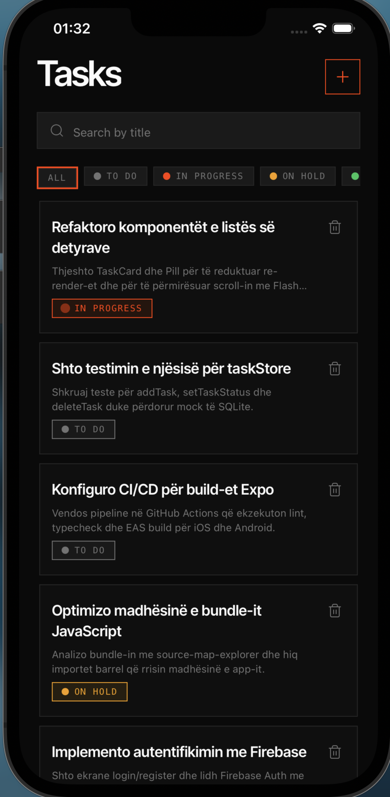
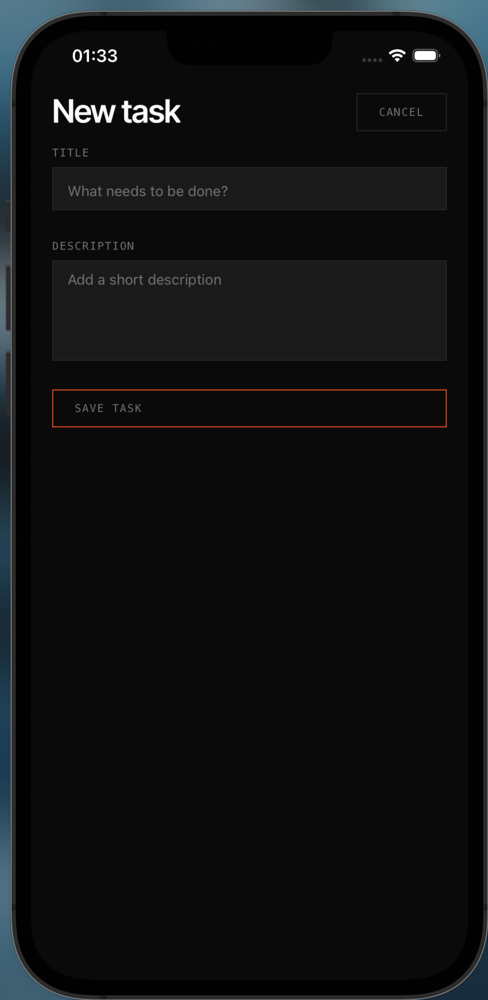
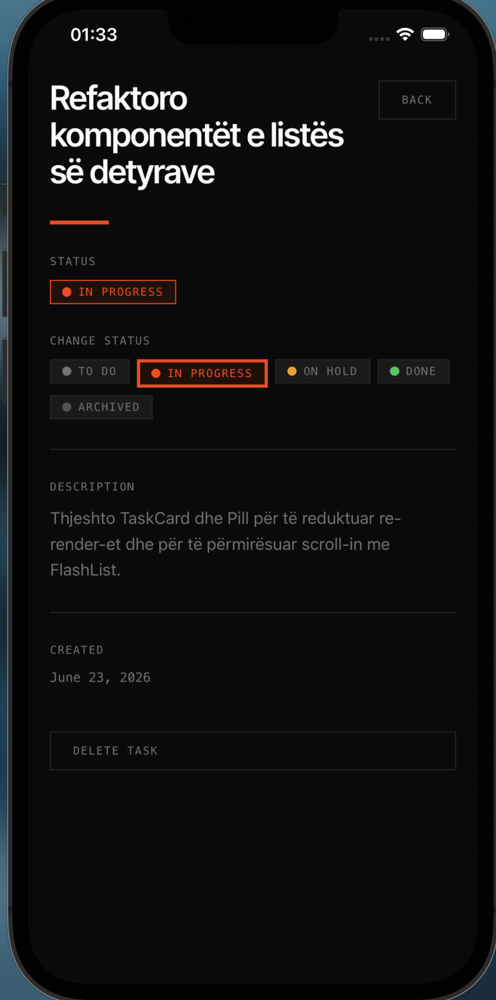

# PriTech Tasks

A React Native task manager built with Expo and TypeScript.

## What was implemented

- Three screens with React Navigation: task list, add task, and task detail
- Full CRUD: add, view, mark complete/incomplete, change status, and delete tasks
- SQLite persistence so tasks survive app restarts
- Initial data loaded from the JSONPlaceholder public API on first launch
- Search tasks by title and filter by status
- Input validation with inline error messages
- Empty, loading, and error states with API retry


## Screenshots

| Task list | Add task | Task detail |
|-----------|----------|-------------|
|  |  |  |

## Install & Run

- Node.js 18+
- npm or yarn
- Expo Go on a physical device, or Xcode / Android Studio for simulators

## Setup

```bash
npm install
npx expo start
```

- Press `i` for iOS simulator
- Press `a` for Android emulator
- Scan the QR code with Expo Go on a physical device

If styles do not load correctly, clear the Metro cache:

```bash
npx expo start --clear
```

## Folder Structure

```
PriTech-1/
├── assets/              Images, icons, and static files
├── components/          Reusable UI (TaskCard, SearchBar, TaskForm, …)
│   └── ui/              Shared primitives (AppText, AppInput, Pill, …)
├── screens/             TaskListScreen, AddTaskScreen, TaskDetailScreen
├── navigation/          RootNavigator and navigation theme
├── store/               Zustand task store
├── hooks/               useTaskDatabase, useTaskFilters
├── services/            API client (jsonPlaceholder.ts) and SQLite (taskDatabase.ts)
├── utils/               Types, validation, seed data, helpers
├── App.tsx              App entry (fonts, SQLiteProvider, navigation)
└── index.ts             Expo entry point
```

## SQLite

Tasks are stored locally with **expo-sqlite**. The database file is `pritech-tasks.db`.

| Layer | File | Role |
|-------|------|------|
| Provider | `App.tsx` | Opens the DB and runs schema setup on launch |
| Schema & queries | `services/taskDatabase.ts` | CREATE TABLE, CRUD operations |
| State | `store/taskStore.ts` | Zustand store synced with SQLite |
| Bootstrap | `hooks/useTaskDatabase.ts` | Initializes store and loads tasks on startup |

**Schema**

```sql
CREATE TABLE tasks (
  id          TEXT PRIMARY KEY NOT NULL,
  title       TEXT NOT NULL,
  description TEXT NOT NULL,
  status      TEXT NOT NULL,
  created_at  TEXT NOT NULL
);
```

On first launch, if the table is empty, tasks are fetched from [JSONPlaceholder](https://jsonplaceholder.typicode.com/todos) (`services/jsonPlaceholder.ts`), mapped to the local schema, and persisted in SQLite. If the request fails, you can retry from the task list or add tasks manually.

**Task statuses:** `todo`, `in_progress`, `on_hold`, `done`, `archived`

